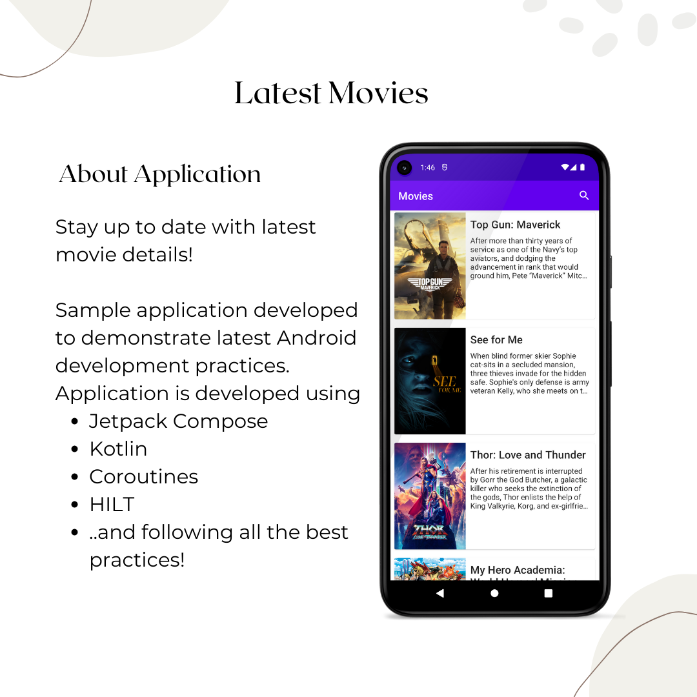

# LatestMovies Application   [](https://github.com/devmanishpatole/LatestMovies/actions/workflows/movies.yml)


**LatestMovies** is a sample Android application, built to demonstrate use of *Modern Android development* tools.


## About
Application loads **Movies** data from [TMDB API](https://www.themoviedb.org/documentation/api) and displays in a list format.
The user can tap on the movie which opens the next screen where users can see total like percentage, release date and overview.
The application supports the lazy loading of movies so users can have a seamless data loading experience. Users can also search a movie.

## Features  

The codebase focuses on following key things:

- [x] Single Activity Design
- [x] Clean and Simple Material UI 🎨
- [x] Jetpack Compose UI
- [x] Tests


## Built With
- [Kotlin](https://kotlinlang.org/) - First class and official programming language for Android development.
- [Coroutines](https://kotlinlang.org/docs/reference/coroutines-overview.html) - For asynchronous operation.
- [Flow](https://kotlin.github.io/kotlinx.coroutines/kotlinx-coroutines-core/kotlinx.coroutines.flow/-flow/) - A cold asynchronous data stream that sequentially emits values and completes normally or with an exception.
- [Jetpack Compose UI Toolkit](https://developer.android.com/jetpack/compose) - Modern UI development toolkit.
- [Paging 3](https://developer.android.com/reference/kotlin/androidx/paging/compose/package-summary) - The Paging Library helps you load and display pages of data from a larger dataset from local storage or over the network.
- [Compose Navigation](https://developer.android.com/jetpack/compose/navigation) - Navigate between composable while taking advantage of the Navigation component’s infrastructure and features.
- [Android Architecture Components](https://developer.android.com/topic/libraries/architecture) - Collection of libraries that help you design robust, testable, and maintainable apps.
    - [ViewModel](https://developer.android.com/topic/libraries/architecture/viewmodel) - Stores UI-related data that isn't destroyed on UI changes.
- [Dependency Injection](https://developer.android.com/training/dependency-injection)
    - [Hilt-Dagger](https://dagger.dev/hilt/) - Standard library to incorporate Dagger dependency injection into an Android application.
    - [Hilt-ViewModel](https://developer.android.com/training/dependency-injection/hilt-jetpack) - DI for injecting `ViewModel`.
- [Retrofit](https://square.github.io/retrofit/) - A type-safe HTTP client for Android and Java.
- [Moshi](https://github.com/square/moshi) - A modern JSON library for Kotlin and Java.
- [Moshi Converter](https://github.com/square/retrofit/tree/master/retrofit-converters/moshi) - A Converter which uses Moshi for serialization to and from JSON.
- [Material Components for Android](https://github.com/material-components/material-components-android) - Modular and customizable Material Design UI components for Android.
- [Coil](https://coil-kt.github.io/coil/) - An image loading library for Android backed by Kotlin Coroutines.
- [JUnit5](https://junit.org/junit5/) - JUnit 5 is the next generation of JUnit and up-to-date foundation for developer-side testing on the JVM. Focusing on Java 8 and above, as well as enabling many different styles of testing.
- [MockK](https://mockk.io/) - Mocking library for Kotlin.


## Architecture
This app uses [***MVVM (Model View View-Model)***](https://developer.android.com/jetpack/docs/guide#recommended-app-arch) architecture.

The philosophy behind this architecture is to enable separation of concerns and ultimately a very modular application.
This architecture was chosen because it provides the opportunity to separate concerns and implement "SOLID" principles which makes the application more robust and the code base scalable and maintainable.

This due separation of moving parts makes the app more testable with unit tests.


## Quality
- [LeakCanary](https://square.github.io/leakcanary/) - LeakCanary is a memory leak detection library for Android.

## Static code analysis
Used [Sonar Lint](https://www.sonarlint.org/) static code analysis.


## Contact
If you need any help, you can connect with me.

Visit:- [devmanishpatole.com](https://www.devmanishpatole.com/)

## License

```
MIT License

Copyright (c) 2020 Manish Patole

Permission is hereby granted, free of charge, to any person obtaining a copy
of this software and associated documentation files (the "Software"), to deal
in the Software without restriction, including without limitation the rights
to use, copy, modify, merge, publish, distribute, sublicense, and/or sell
copies of the Software, and to permit persons to whom the Software is
furnished to do so, subject to the following conditions:

The above copyright notice and this permission notice shall be included in all
copies or substantial portions of the Software.

THE SOFTWARE IS PROVIDED "AS IS", WITHOUT WARRANTY OF ANY KIND, EXPRESS OR
IMPLIED, INCLUDING BUT NOT LIMITED TO THE WARRANTIES OF MERCHANTABILITY,
FITNESS FOR A PARTICULAR PURPOSE AND NONINFRINGEMENT. IN NO EVENT SHALL THE
AUTHORS OR COPYRIGHT HOLDERS BE LIABLE FOR ANY CLAIM, DAMAGES OR OTHER
LIABILITY, WHETHER IN AN ACTION OF CONTRACT, TORT OR OTHERWISE, ARISING FROM,
OUT OF OR IN CONNECTION WITH THE SOFTWARE OR THE USE OR OTHER DEALINGS IN THE
SOFTWARE.
```
